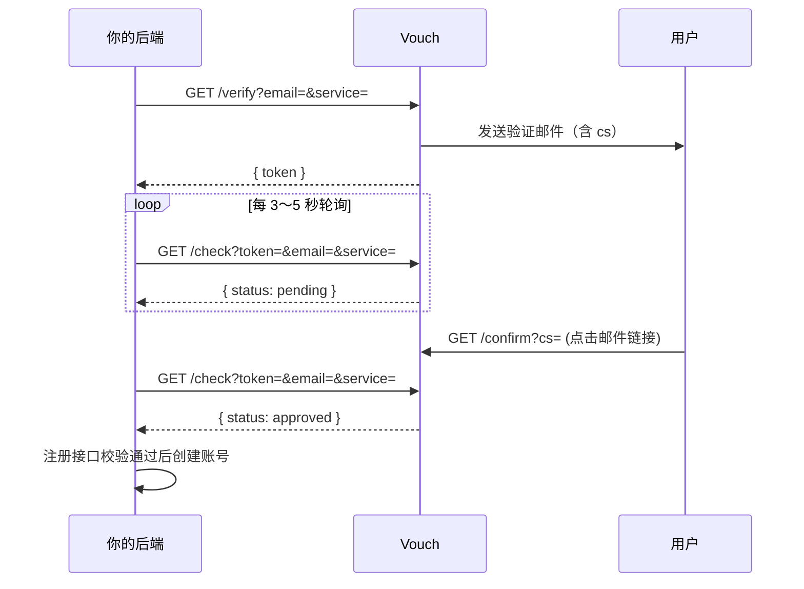

# Vouch

轻量邮箱验证服务，跑在 Cloudflare Workers 上。你的应用发起验证，Vouch 发魔法链接，用户点邮件确认，你的应用轮询结果——三步接入注册流程。



---

## 为什么用 Vouch

**简单上手** — 整个项目只有一个 `worker.js`。复制到 Cloudflare Workers 控制台，绑定 KV、填两个环境变量，就能跑。不需要 Wrangler、不需要数据库、不需要维护服务器。

**可集成** — 三个 HTTP 接口，JSON 进 JSON 出。嵌进注册页：用户填邮箱 → 后端调 `/verify` → 展示「请查收邮件」→ 后端轮询 `/check` → 注册时后端再次确认 `approved`。比验证码更能证明「这个人真的拥有这个邮箱」。

**多服务隔离** — 通过 `service` 参数区分不同站点/业务（惯例传域名如 `blog.example.com`）。同一邮箱可在不同 service 下独立验证。

**可自定义（BYOK）** — 自带 Resend API Key 和发件域名。邮件从你的域名发出，品牌、DNS 认证、投递策略都在你手里。

**够用且安全** — 双凭证（`token` / `cs`）、按 service 限流、`/check` 需 token + email + service 三重匹配。注册放行必须在**你的后端**完成，不能靠前端判断。

---

## 快速开始

### 前置条件

- [Cloudflare](https://dash.cloudflare.com/) 账号（Workers 免费套餐即可）
- [Resend](https://resend.com/) 账号，已验证发件域名

### 1. 创建 KV 并绑定 Worker

1. **Workers & Pages → KV** → Create namespace（如 `VOUCH_KV`）
2. **Workers & Pages → Create Worker** → 命名 `vouch`
3. **Settings → Bindings** → 添加 KV：
   - Variable name: `EMAIL_VERIFY_KV`
   - Namespace: 选刚创建的

### 2. 配置环境变量

**Settings → Variables and Secrets**：

| 变量 | 类型 | 说明 |
|------|------|------|
| `RESEND_API_KEY` | Secret | Resend API Key |
| `FROM_EMAIL` | Text | 已验证发件地址，如 `vouch@yourdomain.com` |

### 3. 部署

把 [`worker.js`](./worker.js) 全部粘贴到 **Edit Code** → **Save and Deploy**。

---

## 使用指南

### `service` 参数

标识接入的业务/站点，`/verify` 与 `/check` 必填。

- **惯例**：传你的站点域名，不含 `https://`，如 `blog.example.com` （实际代码**不校验格式**，任意字符串均可）

### 接入注册流程

```text
1. 用户在注册表单填写邮箱
2. 后端 GET /verify?email=user@example.com&service=blog.example.com
3. 后端保存 token，前端展示「请查收邮件」
4. 后端轮询 GET /check?token=&email=&service=（或封装为自己的 /verify-status）
5. 用户提交注册 → 注册后端再次确认 approved → 创建账号
6. expired → 展示「重新发送」
```


> ### ⚠️ 重要：注册校验在后端
> **不要在前端根据 `/check` 结果决定是否允许注册。** 前端最多用来展示 UI 状态。
> `/verify` 和 `/check` 应由你的**后端**调用 Vouch。用户提交注册时，你的注册接口必须自行确认该 email + service 已通过验证（查 session 或再调 `/check`），否则攻击者可以绕过前端直接调注册 API。

### 示例

```bash
curl "https://vouch.yourdomain.com/verify?email=user@example.com&service=blog.example.com"
# → { "token": "550e8400-..." }

curl "https://vouch.yourdomain.com/check?token=550e8400-...&email=user@example.com&service=blog.example.com"
# → { "status": "pending", "email": "...", "service": "blog.example.com" }
# 用户点邮件后 → { "status": "approved", ... }
```

### API 一览

| 方法 | 路径 | 用途 |
|------|------|------|
| GET | `/verify?email=&service=` | 发起验证，返回 `token` |
| GET | `/confirm?cs=` | 用户点击邮件链接（HTML） |
| GET | `/check?token=&email=&service=` | 轮询验证状态 |


#### 返回体
- **200 成功**
```json
{ "token": "uuid-token" }
```

- **400** 缺少 email 参数
```json
{ "error": "missing_email" }
```

- **400** 缺少 service 参数
```json
{ "error": "missing_service" }
```

- **429** 60 秒内重复发送（同一 service + email）
```json
{ "error": "too_soon" }
```

- **500** Resend 调用失败
```json
{ "error": "email_send_failed" }
```

---

## 技术栈

| 层级 | 选择 |
|------|------|
| 运行时 | Cloudflare Workers |
| 存储 | Cloudflare KV |
| 邮件 | Resend（BYOK） |

---

## License

MIT
