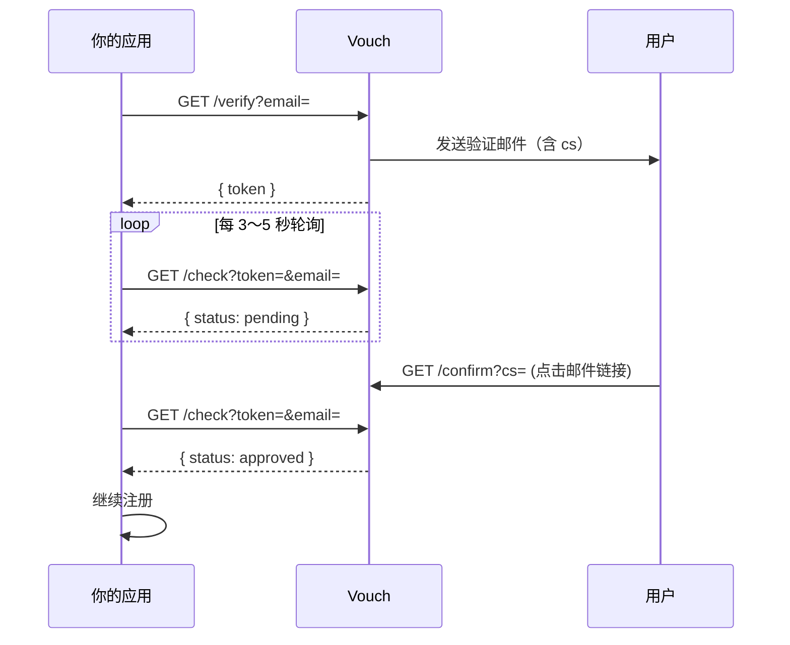

# Vouch

轻量邮箱验证服务，跑在 Cloudflare Workers 上。你的应用发起验证，Vouch 发魔法链接，用户点邮件确认，你的应用轮询结果——三步接入注册流程。



---

## 为什么用 Vouch

**简单上手** — 整个项目只有一个 `worker.js`。复制到 Cloudflare Workers 控制台，绑定 KV、填两个环境变量，就能跑。不需要 Wrangler、不需要数据库、不需要维护服务器。

**可集成** — 三个 HTTP 接口，JSON 进 JSON 出。嵌进注册页：用户填邮箱 → 你调 `/verify` → 展示「请查收邮件」→ 轮询 `/check` → `approved` 后继续注册。比验证码更能证明「这个人真的拥有这个邮箱」。

**可自定义（BYOK）** — 自带 Resend API Key 和发件域名。邮件从你的域名发出，品牌、DNS 认证、投递策略都在你手里，不依赖第三方 SaaS 平台代发。

**零依赖、全球分布** — 单文件、无 npm 包，部署在全球边缘节点。对个人项目和 side project 来说，延迟低、运维成本接近零。

**够用且安全** — Cloudflare Workers + KV + Resend 免费额度对个人项目完全够用。双凭证设计：`token` 仅用于轮询，`cs` 仅出现在邮件链接里，前端拿到 `token` 也无法 curl 绕过邮箱验证；另含 60 秒/email 限流、`/check` 需同时匹配 token 与 email。

---

## 快速开始

### 前置条件

- [Cloudflare](https://dash.cloudflare.com/) 账号（Workers 免费套餐即可）
- [Resend](https://resend.com/) 账号，已验证发件域名

### 1. 创建 KV 并绑定 Worker

1. **Workers & Pages → KV** → Create namespace（如 `VOUCH_KV`）
2. **Workers & Pages → Create Worker** → 命名 `vouch`
3. **Settings → Bindings** → 添加 KV：
   - Variable name: `EMAIL_VERIFY_KV`
   - Namespace: 选刚创建的

### 2. 配置环境变量

**Settings → Variables and Secrets**：

| 变量 | 类型 | 说明 |
|------|------|------|
| `RESEND_API_KEY` | Secret | Resend API Key |
| `FROM_EMAIL` | Text | 已验证发件地址，如 `vouch@yourdomain.com` |

### 3. 部署

把 [`worker.js`](./worker.js) 全部粘贴到 **Edit Code** → **Save and Deploy**。

可选：绑定自定义域名（如 `vouch.yourdomain.com`），邮件里的确认链接会使用调用 `/verify` 时的域名。

---

## 使用指南

### 接入注册流程

```text
1. 用户在注册表单填写邮箱
2. 后端调用 GET /verify?email=user@example.com
3. 保存返回的 token，前端展示「请查收邮件并点击确认链接」
4. 每 3～5 秒轮询 GET /check?token=<token>&email=<email>
5. status === "approved"  → 允许继续注册
6. status === "expired"    → 展示「重新发送」按钮
```

用户点击邮件中的 `/confirm?cs=...` 链接后，轮询才会得到 `approved`。`cs` 不会出现在 API 响应里。

### 示例

**发起验证**

```bash
curl "https://vouch.yourdomain.com/verify?email=user@example.com"
```

```json
{ "token": "550e8400-e29b-41d4-a716-446655440000" }
```

**轮询状态**

```bash
curl "https://vouch.yourdomain.com/check?token=550e8400-e29b-41d4-a716-446655440000&email=user@example.com"
```

```json
{ "status": "pending", "email": "user@example.com" }
```

用户点击邮件链接后：

```json
{ "status": "approved", "email": "user@example.com" }
```

**前端轮询示例（JavaScript）**

```js
async function waitForVerification(token, email) {
  for (let i = 0; i < 120; i++) {
    const res = await fetch(
      `https://vouch.yourdomain.com/check?token=${token}&email=${encodeURIComponent(email)}`
    );
    const data = await res.json();

    if (data.status === "approved") return true;
    if (data.status === "expired") return false;

    await new Promise((r) => setTimeout(r, 3000));
  }
  return false;
}
```

### API 一览

| 方法 | 路径 | 用途 |
|------|------|------|
| GET | `/verify?email=` | 发起验证，发送邮件，返回 `token` |
| GET | `/confirm?cs=` | 用户点击邮件链接（浏览器访问，返回 HTML） |
| GET | `/check?token=&email=` | 轮询验证状态 |

常见错误：`400 missing_email` · `429 too_soon`（60 秒内重复发送）· `404 not_found`（token 与 email 不匹配）

---

## 技术栈

| 层级 | 选择 |
|------|------|
| 运行时 | Cloudflare Workers |
| 存储 | Cloudflare KV |
| 邮件 | Resend（BYOK） |

---

## License

MIT
